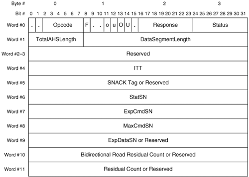
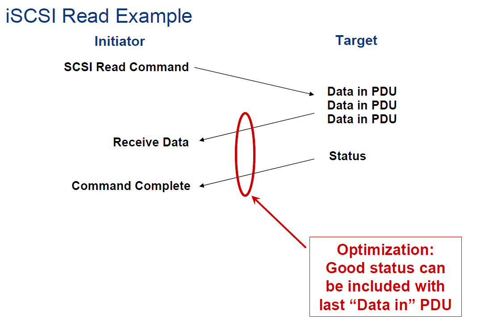
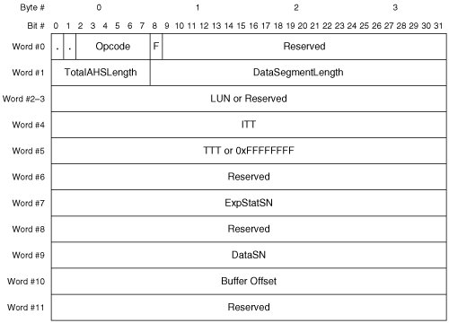
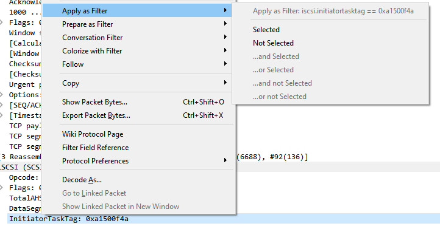
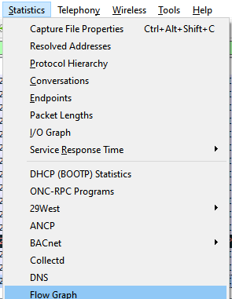
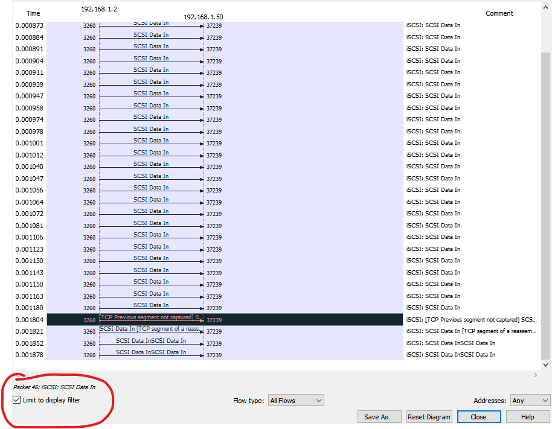
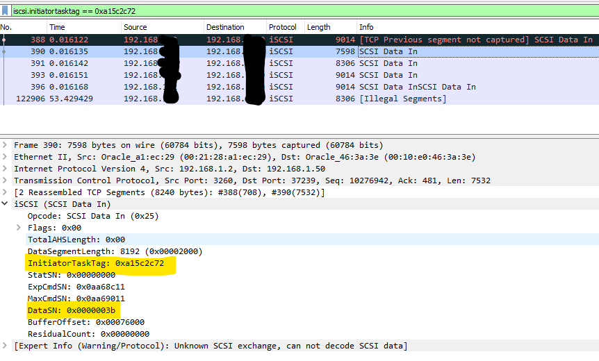

# 6- Storage <!-- Metadata: type: Outline; created: 2020-05-08 14:50:56; reads: 89; read: 2020-05-13 22:58:47; revision: 89; modified: 2020-05-13 22:58:47; importance: 0/5; urgency: 0/5; -->
* [iSCSI in Deep - with Wireshark and tshark](#iscsi-in-deep---with-wireshark-and-tshark) <kbd>iscsi</kbd> <kbd>wireshark</kbd>
* [ZFSSA](#zfssa)
# iSCSI in Deep - with Wireshark and tshark <!-- Metadata: type: Note; tags: iscsi,wireshark; created: 2020-05-10 23:38:30; reads: 68; read: 2020-05-13 22:58:47; revision: 39; modified: 2020-05-13 22:58:47; -->
    

 ## Main references

[RFC 7143 -  Internet Small Computer System Interface (iSCSI) Protocol](https://tools.ietf.org/html/rfc7143 )

[Internet Small Computer System Interface (iSCSI) Parameters](https://www.iana.org/assignments/iscsi-parameters/iscsi-parameters.xhtml )

[iSCSI: The Universal Storage Connection - Oreilly Book ,2002](https://learning.oreilly.com/library/view/iscsi-the-universal/020178419X/ch05.xhtml )

[Storage Networking Protocol Fundamentals By James Long - Cisco PressMay 2006- Oreilly Book link](https://learning.oreilly.com/library/view/storage-networking-protocol/1587051605/ch08.html )


 ### iSCSI PDU Formats 
 iSCSI PDU Formats: iSCSI uses one general PDU format for many purposes. The specific format of an iSCSI PDU is determined by the type of PDU. [RFC 7143](https://tools.ietf.org/html/rfc7143 )  defines numerous PDU types to facilitate communication between initiators and targets. 

 * The primary PDU types include:  
    * login request
    * login response
    * SCSI command
    * SCSI response
    * data-out
    * data-in
    * ready to transfer (R2T)
    * selective negative acknowledgment (SNACK) request
    * task management function (TMF) request
    * TMF response, and reject. 

 All iSCSI PDUs begin with a basic header segment (BHS). The BHS may be followed by one or more additional header segments (AHS), a header-digest, a data segment, or a data-digest. The data-digest may be present only if the data segment is present. 
 


 ### In iSCSI there are two important operations read and write to manage the data see PDUs (BHS) and the flow of those operations (thanks DELL/EMC [iSCSI-Primer](https://www.bswd.com/iSCSI-Primer.pdf))
  
 1.  **Read**

   
---
   

 2.  **Write**

  
---
  

* From the basic to [Display Filters - Wirekshark page](https://wiki.wireshark.org/DisplayFilters)

```
tcp.port eq 25 or icmp
tcp.window_size == 0 && tcp.flags.reset != 1
ip.src != 10.43.54.65 or ip.dst != 10.43.54.65
```

 ### To filter filds in iSCSI - [WireShark Display Filter Reference: iSCSI - link](https://www.wireshark.org/docs/dfref/i/iscsi.html)

Field name|Description|Type
 --- | --- | ---
iscsi.ahs|AHS|Sequence of bytes
iscsi.ahs.bidir.length|Bidirectional Read Data Length|Unsigned integer, 4 bytes
iscsi.ahs.extended_cdb|AHS Extended CDB|Sequence of bytes
iscsi.ahs.length|AHS Length|Unsigned integer, 2 bytes
iscsi.ahs.type|AHS Type|Unsigned integer, 1 byte
iscsi.ahs.unknown_blob|Unknown AHS blob|Sequence of bytesopsc
iscsi.asyncevent|AsyncEvent|Unsigned integer, 1 byte
iscsi.asynceventdata|AsyncEventData|Sequence of bytes
iscsi.bufferOffset|BufferOffset|Unsigned integer, 4 bytes
iscsi.cid|CID|Unsigned integer, 2 bytes
iscsi.cmdsn|CmdSN|Unsigned integer, 4 bytes
iscsi.data_in_frame|Data In in|Frame number
iscsi.data_out_frame|Data Out in|Frame number
iscsi.datadigest|DataDigest|Sequence of bytes
iscsi.datadigest32|DataDigest|Unsigned integer, 4 bytes
iscsi.datasegmentlength|DataSegmentLength|Unsigned integer, 4 bytes
iscsi.datasn|DataSN|Unsigned integer, 4 bytes
iscsi.desireddatalength|DesiredDataLength|Unsigned integer, 4 bytes
iscsi.errorpdudata|ErrorPDUData|Sequence of bytes
iscsi.eventvendorcode|EventVendorCode|Unsigned integer, 1 byte
iscsi.expcmdsn|ExpCmdSN|Unsigned integer, 4 bytes
iscsi.expdatasn|ExpDataSN|Unsigned integer, 4 bytes
iscsi.expstatsn|ExpStatSN|Unsigned integer, 4 bytes
iscsi.flags|Flags|Unsigned integer, 1 byte
iscsi.headerdigest32|HeaderDigest|Unsigned integer, 4 bytes
iscsi.I|I|Boolean
iscsi.immediatedata|ImmediateData|Sequence of bytes
iscsi.initcmdsn|InitCmdSN|Unsigned integer, 4 bytes
iscsi.initiatortasktag|InitiatorTaskTag|Unsigned integer, 4 bytes
iscsi.initstatsn|InitStatSN|Unsigned integer, 4 bytes
iscsi.isid|ISID|Sequence of bytes
iscsi.isid.a|ISID_a|Unsigned integer, 1 byte
iscsi.isid.b|ISID_b|Unsigned integer, 2 bytes
iscsi.isid.c|ISID_c|Unsigned integer, 1 byte
iscsi.isid.d|ISID_d|Unsigned integer, 2 bytes
iscsi.isid.namingauthority|ISID_NamingAuthority|Unsigned integer, 3 bytes
iscsi.isid.qualifier|ISID_Qualifier|Unsigned integer, 1 byte
iscsi.isid.t|ISID_t|Unsigned integer, 1 byte
iscsi.isid.type|ISID_Type|Unsigned integer, 1 byte
iscsi.isid8|ISID|Unsigned integer, 2 bytes
iscsi.keyvalue|KeyValue|Character string
iscsi.keyvalue.invalid|Invalid key/value pair|Label
iscsi.login.C|C|Boolean
iscsi.login.csg|CSG|Unsigned integer, 1 byte
iscsi.login.nsg|NSG|Unsigned integer, 1 byte
iscsi.login.status|Status|Unsigned integer, 2 bytes
iscsi.login.T|T|Boolean
iscsi.login.X|X|Boolean
iscsi.logout.reason|Reason|Unsigned integer, 1 byte
iscsi.logout.response|Response|Unsigned integer, 1 byte
iscsi.lun|LUN|Sequence of bytes
iscsi.maxcmdsn|MaxCmdSN|Unsigned integer, 4 bytes
iscsi.opcode|Opcode|Unsigned integer, 1 byte
iscsi.padding|Padding|Sequence of bytes
iscsi.parameter1|Parameter1|Unsigned integer, 2 bytes
iscsi.parameter2|Parameter2|Unsigned integer, 2 bytes
iscsi.parameter3|Parameter3|Unsigned integer, 2 bytes
iscsi.pingdata|PingData|Sequence of bytes
iscsi.r2tsn|R2TSN|Unsigned integer, 4 bytes
iscsi.readdata|ReadData|Sequence of bytes
iscsi.refcmdsn|RefCmdSN|Unsigned integer, 4 bytes
iscsi.reject.reason|Reason|Unsigned integer, 1 byte
iscsi.request_frame|Request in|Frame number
iscsi.response_frame|Response in|Frame number
iscsi.scsicommand.addcdb|AddCDB|Unsigned integer, 1 byte
iscsi.scsicommand.attr|Attr|Unsigned integer, 1 byte
iscsi.scsicommand.crn|CRN|Unsigned integer, 1 byte
iscsi.scsicommand.expecteddatatransferlength|ExpectedDataTransferLength|Unsigned integer, 4 bytes
iscsi.scsicommand.F|F|Boolean
iscsi.scsicommand.R|R|Boolean
iscsi.scsicommand.W|W|Boolean
iscsi.scsidata.A|A|Boolean
iscsi.scsidata.F|F|Boolean
iscsi.scsidata.O|O|Boolean
iscsi.scsidata.readresidualcount|ResidualCount|Unsigned integer, 4 bytes
iscsi.scsidata.S|S|Boolean
iscsi.scsidata.U|U|Boolean
iscsi.scsiresponse.bidireadresidualcount|BidiReadResidualCount|Unsigned integer, 4 bytes
iscsi.scsiresponse.o|o|Boolean
iscsi.scsiresponse.residualcount|ResidualCount|Unsigned integer, 4 bytes
iscsi.scsiresponse.response|Response|Unsigned integer, 1 byte
iscsi.scsiresponse.senselength|SenseLength|Unsigned integer, 2 bytes
iscsi.scsiresponse.status|Status|Unsigned integer, 1 byte
iscsi.scsiresponse.u|u|Boolean
iscsi.snack.begrun|BegRun|Unsigned integer, 4 bytes
iscsi.snack.runlength|RunLength|Unsigned integer, 4 bytes
iscsi.snack.type|S|Unsigned integer, 1 byte
iscsi.statsn|StatSN|Unsigned integer, 4 bytes
iscsi.targettransfertag|TargetTransferTag|Unsigned integer, 4 bytes
iscsi.taskmanfun.function|Function|Unsigned integer, 1 byte
iscsi.taskmanfun.referencedtasktag|ReferencedTaskTag|Unsigned integer, 4 bytes
iscsi.taskmanfun.response|Response|Unsigned integer, 1 byte
iscsi.text.C|C|Boolean
iscsi.text.F|F|Boolean
iscsi.time|Time from request|Time offset
iscsi.time2retain|Time2Retain|Unsigned integer, 2 bytes
iscsi.time2wait|Time2Wait|Unsigned integer, 2 bytes
iscsi.totalahslength|TotalAHSLength|Unsigned integer, 1 byte
iscsi.tsid|TSID|Unsigned integer, 2 bytes
iscsi.tsih|TSIH|Unsigned integer, 2 bytes
iscsi.vendorspecificdata|VendorSpecificData|Sequence of bytes
iscsi.versionactive|VersionActive|Unsigned integer, 1 byte
iscsi.versionmax|VersionMax|Unsigned integer, 1 byte
iscsi.versionmin|VersionMin|Unsigned integer, 1 byte
iscsi.writedata|WriteData|Sequence of bytes
iscsi.X|X|Boolean


* some expamples [Display Filter Reference: iSCSI - Wireshark page](https://www.wireshark.org/docs/dfref/i/iscsi.html)

```
* To check the iSCSI sessionType as normal

iscsi.keyvalue == "SessionType=Normal"

* WireShark filter to check if keyvalue.invalid is present

iscsi.keyvalue.invalid 
```


 ### Using ITT to filter the secuence of read and write operations.
 * You must follow the iSCSI data flow using the initiator task tag (ITT) field.
 
  **Initiator Task Tag (ITT)—.** [Storage Networking Protocol Fundamentals]( https://learning.oreilly.com/library/view/storage-networking-protocol/1587051605/ch08.html ) This is 32 bits long. It contains a tag assigned by the initiator. An ITT is assigned to each iSCSI task. Likewise, an ITT is assigned to each SCSI task. A SCSI task can represent a single SCSI command or multiple linked commands. Each SCSI command can have many SCSI activities associated with it. A SCSI task encompasses all activities associated with a SCSI command or multiple linked commands. Likewise, an ITT that represents a SCSI task also encompasses all associated activities of the SCSI command(s). An ITT value is unique only within the context of the current session. The iSCSI ITT is similar in function to the FC fully qualified exchange identifier (FQXID).
 
 
 * You must filter in wireshark using the field iscsi.initiatortasktag == 0xa1500f4a to follow the read or write operations.

  

 * You can create a flow graph with wirekshark

  

 * Check - Limit do display filter

  


 ### You can check the DataSN in PDU to check the secuence of Data In (Read) or Data Out(Write) 

  * **Data Sequence Number (DataSN):**. This is 32 bits long. This field uniquely identifies each Data-Out PDU within each sequence of PDUs. The DataSN is similar in function to the FC SEQ_ID. Each SCSI write command is satisfied with one or more sequences of PDUs. Each PDU sequence is identified by the ITT (for unsolicited data) or the TTT (for solicited data). This field is incremented by one for each Data-Out PDU transmitted within a sequence. A retransmitted Data-Out PDU carries the same DataSN as the original PDU. The counter is reset for each new sequence within the context a single command.
  
  * In below example I filtered by iscsi.initiatortasktag == 0xa15c2c72 and you can see the secuense of DataSN field.

  
---  
  


 ### Right I used as exmple a wrong(bad) iscsi 

 ## Using tshark command line of Wireshark. 

 [Instant Traffic Analysis with Tshark How-to - Oreilly book](https://learning.oreilly.com/library/view/instant-traffic-analysis/9781782165385/)

 [T-Shark Usage Examples ](https://www.cellstream.com/reference-reading/tipsandtricks/272-t-shark-usage-examples)

 ### 1. Check all the package that are wrong/bad using tcp.analysis.flags  parameter and  create a new pcap output file.

```
$ tshark -r snoop-6.net0 -w sol6tcp.analysis.flags_iscsi.initiatortasktag.out  tcp.analysis.flags

$ tshark -r tcp_analysis_flags.cap |wc -l
43606

```

 ### 2. Create a new filter with package that only have the iscsi.initiatortasktag


```
tshark -r tcp_analysis_flags.cap -T fields -e frame.time -e ip.src -e ip.dst -e iscsi.initiatortasktag -e col.Info iscsi.initiatortasktag
(..)
"Apr 28, 2020 12:11:52.316020000 UTC"   192.168.1.2     192.168.1.50    0x188c1020      [TCP ACKed unseen segment] [TCP Previous segment not captured] Ready To Transfer
"Apr 28, 2020 12:11:52.318354000 UTC"   192.168.1.50    192.168.1.2     0x188c1020      [TCP ACKed unseen segment] [TCP Previous segment not captured] SCSI Data Out
"Apr 28, 2020 12:11:52.318425000 UTC"   192.168.1.50    192.168.1.2     0x188c1020      [TCP ACKed unseen segment] SCSI Data Out
"Apr 28, 2020 12:11:52.318971000 UTC"   192.168.1.50    192.168.1.2     0x1888241a      [TCP ACKed unseen segment] [TCP Previous segment not captured] SCSI Data Out
"Apr 28, 2020 12:11:52.318994000 UTC"   192.168.1.50    192.168.1.2     0x1888241a      [TCP ACKed unseen segment] SCSI Data Out
"Apr 28, 2020 12:11:52.320624000 UTC"   192.168.1.50    192.168.1.2     0x1891065e      [TCP ACKed unseen segment] [TCP Previous segment not captured] SCSI Data Out
"Apr 28, 2020 12:11:52.320670000 UTC"   192.168.1.50    192.168.1.2     0x1891065e      [TCP ACKed unseen segment] SCSI Data Out
"Apr 28, 2020 12:11:52.321565000 UTC"   192.168.1.50    192.168.1.2     0x1891065e      [TCP ACKed unseen segment] [TCP Previous segment not captured] SCSI Data Out
"Apr 28, 2020 12:11:52.321591000 UTC"   192.168.1.2     192.168.1.50    0x188f284d      [TCP ACKed unseen segment] [TCP Previous segment not captured] Ready To Transfer
"Apr 28, 2020 12:11:52.321905000 UTC"   192.168.1.50    192.168.1.2     0x1891065e      [TCP ACKed unseen segment] [TCP Previous segment not captured] SCSI Data Out

```
 ### 3. Or just show the iscsi ITT (iscsi.initiatortasktag) value.

```
tshark -r tcp_analysis_flags.cap -T fields -e iscsi.initiatortasktag  iscsi.initiatortasktag
0xfaea01a3
0xfaeb26b2
0xfaec1f45
0xfb011496
0xfb021c4b
0xfb0305e4
0xfb042033
0xfb1a0d22
0xfb2b2a9a
0xfb2c13d9
0xfb4709fe
0xfb5b1d58
0xfc572ba2
0xfc821c4b
0xfc831ac8
(...)
```

  ### Then now we can check more in detail each flow with the iscsi.initiatortasktag value

```
$ tshark -r tcp_analysis_flags.cap -T fields -e frame.time -e ip.src -e ip.dst -e iscsi.datasn -e iscsi.initiatortasktag -e iscsi.opcode  -e col.Info iscsi.initiatortasktag==0xad25019d

"Apr 28, 2020 12:07:45.318989000 UTC"   192.168.1.2     192.168.1.50    0x00000046      0xad25019d      0x00000025      [TCP Previous segment not captured] SCSI Data In
```

 ### [Chapter 11. Error Handling oreilly book link](https://learning.oreilly.com/library/view/iscsi-the-universal/020178419X/ch11.xhtml)

There are three general classes of detected errors:

1. **Protocol error:**  As its name implies, this is generally a program error and requires restarting the session and error recovery by the SCSI layer.

2. **CRC detected error:**. This error could have been detected on the PDU header or data segment. It can be recovered by resending the data or response PDU or by reissuing the command PDU, depending on what was missing. Some implementations will not be able to recover from this error and will respond as for a protocol error.

3. **TCP/IP or link failure:** This error can often be recovered by restarting another connection and shifting command and data allegiance to it from the failed connection. Some implementations will not be able to recover from such a failure and will respond as for a protocol error.

The session restart, which must be used on protocol errors, can be used on any of the other failures also. Because only session restart is mandatory, some implementations are likely to have only that technique. That is, all error recovery can use what is called technique 0.


 ### [Opcode (RFC7143)](https://tools.ietf.org/html/rfc7143#section-11.2.1.2)


   The Opcode indicates the type of iSCSI PDU the header encapsulates.

   The Opcodes are divided into two categories: initiator Opcodes and
   target Opcodes.  Initiator Opcodes are in PDUs sent by the initiator
   (Request PDUs).  Target Opcodes are in PDUs sent by the target
   (Response PDUs).


* To filter all the opcode in wireshark

```
WireShark filter to check if iscsi.opcode is present
iscsi.opcode && iscsi

(iscsi.opcode==0x20 or iscsi.opcode==0x21 or iscsi.opcode==0x22 or iscsi.opcode==0x23 or iscsi.opcode==0x24 or iscsi.opcode==0x25 or iscsi.opcode==0x26 or iscsi.opcode==0x31 or iscsi.opcode==0x32 or iscsi.opcode==0x3c or iscsi.opcode==0x3e or iscsi.opcode==0x3f or iscsi.opcode==0x00 or iscsi.opcode==0x01 or iscsi.opcode==0x02 or iscsi.opcode==0x03 or iscsi.opcode==0x04 or iscsi.opcode==0x05 or iscsi.opcode==0x06 or iscsi.opcode==0x10 or iscsi.opcode==0x1c or iscsi.opcode==0x1e) && iscsi

```
* Target OpCodes 

```

   Target opcodes are:

     0x20 NOP-In
     0x21 SCSI Response - contains SCSI status and possibly sense       information or other response information.
     0x22 SCSI Task Management function response
     0x23 Login Response
     0x24 Text Response
     0x25 SCSI Data-In - for READ operations.
     0x26 Logout Response
     0x31 Ready To Transfer (R2T) - sent by target when it is ready to receive data.
     0x32 Asynchronous Message - sent by target to indicate certain  special conditions.
     0x3c-0x3e Vendor specific codes
     0x3f Reject
	 
```

* wireshark to filter all the Target opcode 

```
(iscsi.opcode==0x20 or iscsi.opcode==0x21 or iscsi.opcode==0x22 or iscsi.opcode==0x23 or iscsi.opcode==0x24 or iscsi.opcode==0x25 or iscsi.opcode==0x26 or iscsi.opcode==0x31 or iscsi.opcode==0x32 or iscsi.opcode==0x3c or iscsi.opcode==0x3e or iscsi.opcode==0x3f) && iscsi
```

* Initiator OpCodes


```
	 Initiator opcodes defined in this specification are:

     0x00 NOP-Out
     0x01 SCSI Command (encapsulates a SCSI Command Descriptor Block)
     0x02 SCSI Task Management function request
     0x03 Login Request
     0x04 Text Request
     0x05 SCSI Data-Out (for WRITE operations)
     0x06 Logout Request
     0x10 SNACK Request
     0x1c-0x1e Vendor specific codes
	  
```

* WireShark To filter all the Initiator opcode

```
(iscsi.opcode==0x00 or iscsi.opcode==0x01 or iscsi.opcode==0x02 or iscsi.opcode==0x03 or iscsi.opcode==0x04 or iscsi.opcode==0x05 or iscsi.opcode==0x06 or iscsi.opcode==0x10 or iscsi.opcode==0x1c or iscsi.opcode==0x1e) && iscsi

```
 ### [10.4.2.  Status (RFC7143) ](https://tools.ietf.org/html/rfc7143#section-11.4.2)

```

  The Status field is used to report the SCSI status of the command (as
   specified in [SAM2]) and is only valid if the Response Code is
   Command Completed at target.
   Some of the status codes defined in [SAM2] are:

     0x00 GOOD
     0x02 CHECK CONDITION
     0x08 BUSY
     0x18 RESERVATION CONFLICT
     0x28 TASK SET FULL
     0x30 ACA ACTIVE
	 0x40 TASK ABORTED

10.4.3.  Response

   This field contains the iSCSI service response.

   iSCSI service response codes defined in this specification are:

     0x00 - Command Completed at Target
     0x01 - Target Failure
     0x80-0xff - Vendor specific
	 
```
* WireShark filter for SCSI status of the command
```
WireShark filter to check if iscsi.opcode is present
iscsi.scsiresponse.status && iscsi


All SCSI response status
(iscsi.scsiresponse.status==0x00 or iscsi.scsiresponse.status==0x02 or iscsi.scsiresponse.status==0x08 or iscsi.scsiresponse.status==0x18 or iscsi.scsiresponse.status==0x28 or iscsi.scsiresponse.status==0x30 or iscsi.scsiresponse.status==0x40)


	 0x08 BUSY
     0x28 TASK SET FULL
     0x18 RESERVATION CONFLICT
	 0x40 TASK ABORTED

(iscsi.scsiresponse.status==0x08 or iscsi.scsiresponse.status==0x28 or iscsi.scsiresponse.status==0x18 or iscsi.scsiresponse.status==0x40) && iscsi
```

 * WireShark filter for status response
 
```
all status response

( iscsi.scsiresponse.status==0x00 or iscsi.scsiresponse.status==0x01 or iscsi.scsiresponse.status==0x80 or iscsi.scsiresponse.status==0xff) && iscsi


     0x00 - Command Completed at Target
(iscsi.scsiresponse.status==0x00 ) && iscsi

```

 ### [Reject - Reason - RFC7143](https://tools.ietf.org/html/rfc7143#section-11.17.1)
 
 
 
   Code (hex)| Explanation|Can the original PDU be resent?  
   ---|---|---
   0x01 | Reserved                               | no             
   0x02 | Data (payload) digest error            | yes (Note 1)   
   0x03 | SNACK Reject                           | yes            
   0x04 | Protocol Error (e.g., SNACK Request for  a status that was already acknowledged)| no             
   0x05 | Command not supported                  | no             
   0x06 | Immediate command reject - too many  immediate commands  | yes            
   0x07 | Task in progress                       | no             
   0x08 | Invalid data ack                       | no             
   0x09 | Invalid PDU field                      | no (Note 2)    
   0x0a | Long op reject - Can't generate Target Transfer Tag - out of resources  | yes            
   0x0b | Deprecated; MUST NOT be used           | N/A (Note 3)   
   0x0c | Waiting for Logout                     | no             
 
 
   Note 1: For iSCSI, Data-Out PDU retransmission is only done if the
           target requests retransmission with a recovery R2T.  However,
           if this is the data digest error on immediate data, the
           initiator may choose to retransmit the whole PDU, including
           the immediate data.

   Note 2: A target should use this reason code for all invalid values
           of PDU fields that are meant to describe a task, a response,
           or a data transfer.  Some examples are invalid TTT/ITT,
           buffer offset, LUN qualifying a TTT, and an invalid sequence
           number in a SNACK.
 ```
 WireShark filter to check if iscsi.opcode is present
 iscsi.reject.reason && iscsi

 (iscsi.reject.reason==0x00 or iscsi.reject.reason==0x02 or iscsi.reject.reason==0x08 or iscsi.reject.reason==0x18 or iscsi.reject.reason==0x28 or iscsi.reject.reason==0x30 or iscsi.reject.reason==0x40 or iscsi.reject.reason==0x00 or iscsi.reject.reason==0x01 or iscsi.reject.reason==0x80 or iscsi.reject.reason==0xff) && iscsi
 ```


# ZFSSA <!-- Metadata: type: Note; created: 2020-05-08 14:51:21; reads: 13; read: 2020-05-11 10:35:23; revision: 2; modified: 2020-05-08 14:51:26; -->

